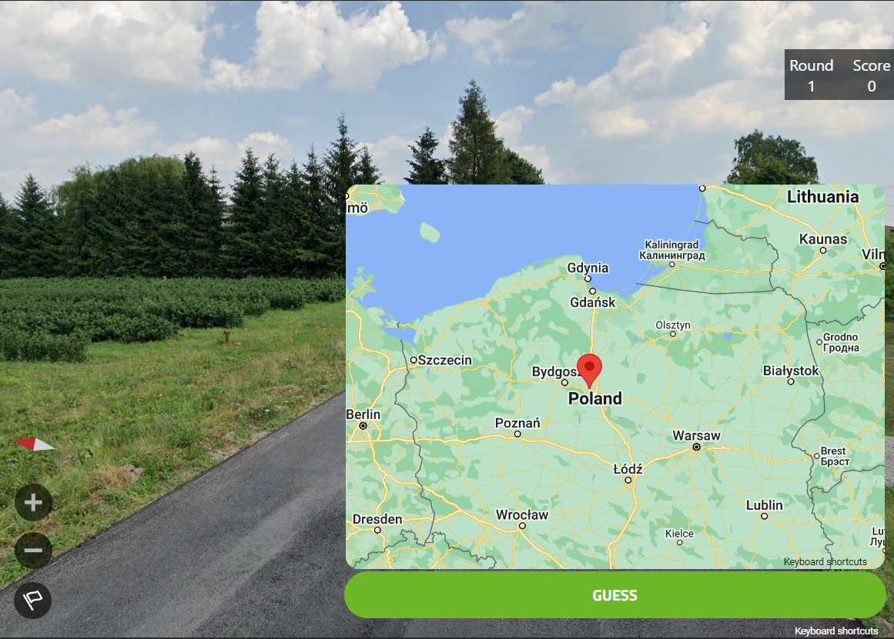
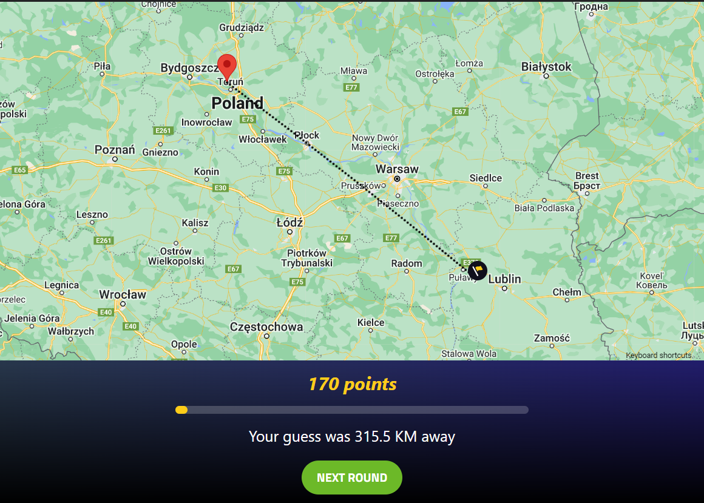
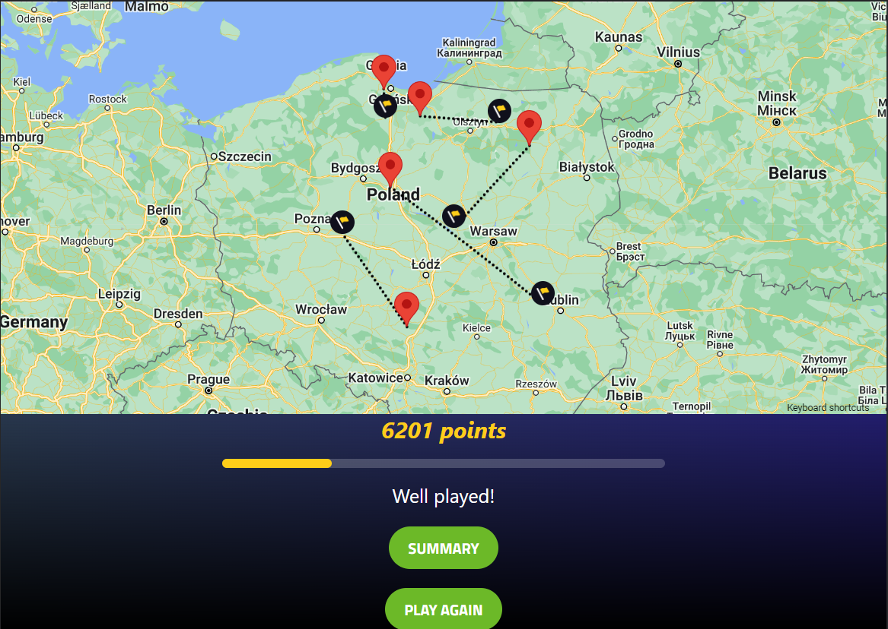

# GeoguessrCloneReact 

This is a clone of popular geographical game called 'Geoguessr'.  
At this point it is possible to play singleplayer on two maps with randomly generated locations.
Demo app: https://geoguessr-clone.netlify.app/

### Gameplay layout:

### End of round:

### End of the game:

Future development plan:
- menu styling
- creating accounts
- multiplayer mode
